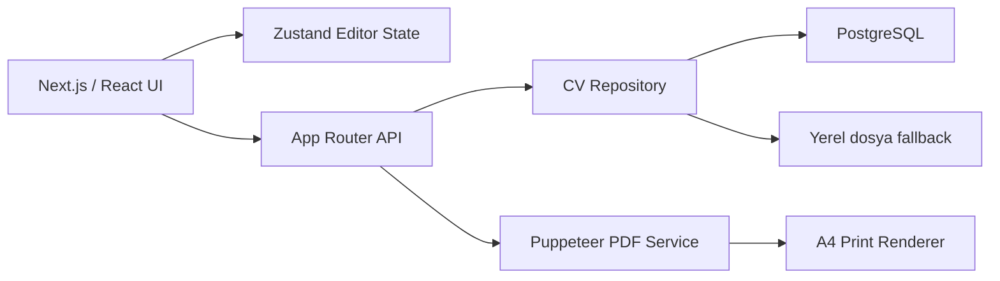

<p align="center">
  
</p>

<h1 align="center">CVCraft</h1>

<p align="center">
  Profesyonel CV oluşturma, düzenleme, yönetme ve PDF olarak dışa aktarma süreçlerini tek bir çalışma alanında birleştiren modern web uygulaması.
</p>

<p align="center">
  <a href="https://cv-craft-psi.vercel.app"><strong>Canlı Uygulama</strong></a>
  ·
  <a href="#hızlı-başlangıç">Kurulum</a>
  ·
  <a href="#vercel-dağıtımı">Dağıtım</a>
</p>

<p align="center">
  
  
  
  
</p>

## Genel Bakış

CVCraft, CV hazırlama sürecini içerik girişinden profesyonel PDF çıktısına kadar uçtan uca yönetir. Kullanıcılar hazır şablonlardan birini seçebilir, CV ön izlemesi üzerinde doğrudan düzenleme yapabilir, bölümleri yeniden sıralayabilir ve içerik kaybetmeden şablon değiştirebilir.

Uygulama; Next.js App Router, React, TypeScript ve Zustand üzerine kuruludur. Kalıcı veri için PostgreSQL ve Drizzle ORM kullanır; yerel geliştirmede dosya tabanlı depolamaya geri dönebilir. PDF çıktıları Puppeteer ve Vercel uyumlu Chromium ile sunucu tarafında üretilir.

## Temel Özellikler

### CV Editörü

- CV ön izlemesi üzerinden doğrudan metin düzenleme
- Seçili metne özel font, boyut, renk, kalınlık, stil ve hizalama uygulama
- Madde işaretli ve numaralı liste, girinti, satır aralığı ve harf aralığı kontrolleri
- Times New Roman dahil 20 profesyonel font ve aranabilir font seçici
- 50 adıma kadar geri alma ve ileri alma geçmişi
- Manuel kaydetme, kaydedilmemiş değişiklik takibi ve kullanıcı dostu durum bildirimleri

### Bölüm ve İçerik Yönetimi

- İş deneyimi, eğitim, yetenek, dil, proje, sertifika, referans ve ilgi alanı bölümleri
- Özel bölüm oluşturma, yeniden adlandırma, çoğaltma, gizleme ve silme
- Fotoğraf, ad ve ünvan, iletişim, kişisel bilgiler, özet ve tüm CV bölümlerini sol/sağ sütunlar arasında taşıma
- Ön izleme üzerinde sürükle-bırak ve mobil uyumlu yön düğmeleriyle yerleşim yönetimi
- Yan sütunu desteklenen şablonlarda sola veya sağa konumlandırma
- Virgül, noktalı virgül ya da yeni satır kullanarak toplu içerik ekleme
- İsteğe bağlı madde işareti, yetenek seviyesi ve dil seviyesi desteği
- Doğum tarihi, uyruk, medeni durum, askerlik durumu ve ehliyet gibi isteğe bağlı kişisel alanlar

### Tasarım ve Şablonlar

- Modern, Klasik, Yaratıcı, Minimal, ATS Pro, Executive, Corporate, Consultant, Editorial ve Tech Focus şablonları
- Şablon değiştirirken CV içeriğini ve bölüm sırasını koruma
- Tema rengi, tipografi, yazı boyutu, boşluk ve fotoğraf biçimi ayarları
- Fotoğraf kırpma, ölçekleme, konumlandırma, döndürme, çevirme ve filtre kontrolleri
- Masaüstü, tablet ve mobil ekranlara uyumlu editör deneyimi

### PDF ve Kayıt Yönetimi

- İndirme öncesinde tam CV ön izlemesi ve kullanıcı onayı
- İçerik arttıkça uzayan A4 ön izleme ve otomatik çok sayfalı çıktı
- Fontları, arka planları, fotoğraf ayarlarını ve bölüm sırasını koruyan PDF üretimi
- Dashboard üzerinden CV oluşturma, düzenleme ve onay penceresiyle silme
- PostgreSQL kalıcılığı ve yerel geliştirme için dosya tabanlı fallback
- Yönetici rolü için CV ve şablon kullanım görünümü

## Kullanıcı Akışı

1. Kullanıcı güvenli oturum ekranından uygulamaya giriş yapar.
2. Dashboard üzerinden yeni bir CV oluşturur veya mevcut CV'sini açar.
3. Profesyonel şablonlardan birini seçer.
4. İçerikleri panelden veya doğrudan CV ön izlemesi üzerinden düzenler.
5. Bölümleri sıralar, sütunlar arasında taşır ve görsel ayarları özelleştirir.
6. Değişiklikleri manuel olarak kaydeder.
7. İndirme ön izlemesini kontrol ederek CV'yi PDF olarak dışa aktarır.

## Teknoloji Yığını

| Katman | Teknoloji |
| --- | --- |
| Framework | Next.js 16, App Router |
| Kullanıcı arayüzü | React 19, Tailwind CSS 4, Lucide React |
| Durum yönetimi | Zustand 5 |
| Form ve doğrulama | React Hook Form, Zod |
| Animasyon ve 3D | Framer Motion, Three.js |
| Veritabanı | PostgreSQL, Drizzle ORM |
| PDF üretimi | Puppeteer Core, `@sparticuz/chromium` |
| Dil ve kalite | TypeScript 5.9, ESLint 9 |
| Dağıtım | Vercel |

## Mimari



Editör verisi ortak `CVData` modeli üzerinden şablonlara aktarılır. Bu yaklaşım, içerik ile görsel sunumu birbirinden ayırır ve şablon geçişlerinde veri kaybını önler. Sunucu tarafındaki repository katmanı ise PostgreSQL ile yerel depolama arasındaki seçimi merkezi olarak yönetir.

## Hızlı Başlangıç

### Gereksinimler

- Node.js `20.9.0` veya üzeri
- npm
- Kalıcı bulut kaydı kullanılacaksa PostgreSQL

### Kurulum

```bash
git clone https://github.com/ErdemYy/CVCraft.git
cd CVCraft
npm install
```

Ortam dosyasını oluşturun:

```bash
# macOS / Linux
cp .env.example .env.local

# Windows PowerShell
Copy-Item .env.example .env.local
```

Geliştirme sunucusunu başlatın:

```bash
npm run dev
```

Uygulama varsayılan olarak [http://localhost:3000](http://localhost:3000) adresinde çalışır.

## Ortam Değişkenleri

| Değişken | Zorunluluk | Açıklama |
| --- | --- | --- |
| `DATABASE_URL` | Production için önerilir | PostgreSQL bağlantı adresi |
| `PUPPETEER_EXECUTABLE_PATH` | İsteğe bağlı | Yerel Chrome veya Edge executable yolu |
| `ADMIN_USERNAME` | Production için gerekli | Yönetici kullanıcı adı |
| `ADMIN_PASSWORD` | Production için gerekli | Yönetici parolası |
| `ADMIN_DISPLAY_NAME` | İsteğe bağlı | Yönetici görünen adı |
| `USER_USERNAME` | Production için gerekli | Standart kullanıcı adı |
| `USER_ALIAS` | İsteğe bağlı | Standart kullanıcı için alternatif giriş adı |
| `USER_PASSWORD` | Production için gerekli | Standart kullanıcı parolası |
| `USER_DISPLAY_NAME` | İsteğe bağlı | Standart kullanıcı görünen adı |

Örnek değerler [.env.example](.env.example) dosyasında bulunur. Production ortamında uygulamanın varsayılan kimlik bilgilerini kullanmayın; güçlü ve benzersiz değerler tanımlayın.

## Veri Saklama

`DATABASE_URL` tanımlandığında CV kayıtları PostgreSQL üzerinde saklanır. İlk kurulumda tabloyu oluşturmak veya şemayı güncellemek için:

```bash
npm run db:push
```

`DATABASE_URL` bulunmadığında uygulama yerel geliştirmede `.data/cvs.json` dosyasını kullanır. Serverless dosya sistemleri kalıcı olmadığından Vercel production ortamında PostgreSQL kullanılması gerekir. Uygulamanın cihaz depolaması desteği, geçici bağlantı veya sunucu depolama sorunlarında manuel kayıt akışını korumaya yardımcı olur; hesaplar ve cihazlar arası kalıcı senkronizasyonun yerini tutmaz.

## PDF Üretim Akışı

1. Editördeki güncel `CVData`, kimliği doğrulanmış PDF endpoint'ine gönderilir.
2. Sunucu, veriyi izole `/print` görünümüne aktarır.
3. Fontların ve görsellerin yüklenmesi beklenir.
4. Puppeteer, arka planları koruyarak A4 PDF üretir.
5. Dosya, kullanıcı adına göre güvenli bir dosya adıyla indirilir.

Yerel ortamda sistemde kurulu Chrome veya Edge kullanılabilir. Uygun tarayıcı bulunamazsa `@sparticuz/chromium` devreye girer; bu sayede aynı export akışı Vercel üzerinde de çalışır.

## Kullanılabilir Komutlar

| Komut | Açıklama |
| --- | --- |
| `npm run dev` | Geliştirme sunucusunu başlatır |
| `npm run build` | Optimize production build oluşturur |
| `npm run start` | Production sunucusunu başlatır |
| `npm run typecheck` | TypeScript tip kontrolünü çalıştırır |
| `npm run lint` | ESLint kalite kontrolünü çalıştırır |
| `npm run db:push` | Drizzle şemasını PostgreSQL'e uygular |

## Proje Yapısı

```text
src/
├── app/                    Sayfalar, layout ve API route'ları
│   ├── api/                Auth, CV, health ve PDF endpoint'leri
│   ├── dashboard/          Kayıtlı CV yönetimi
│   ├── editor/             CV düzenleme sayfası
│   ├── print/              PDF için A4 render görünümü
│   └── templates/          Şablon seçme sayfası
├── components/
│   ├── admin/              Yönetim paneli bileşenleri
│   ├── auth/               Giriş, kayıt ve 3D arka plan
│   ├── brand/              Ortak marka bileşenleri
│   ├── common/             Paylaşılan UI bileşenleri
│   ├── dashboard/          Dashboard bileşenleri
│   ├── editor/             Editör panelleri ve araçları
│   ├── landing/            Landing page bileşenleri
│   └── templates/          CV render ve şablon bileşenleri
├── db/                     Drizzle bağlantısı ve PostgreSQL şeması
├── lib/                    Modeller, repository ve yardımcı servisler
└── store/                  Zustand editör store'u
```

## Vercel Dağıtımı

1. Repoyu GitHub hesabınıza fork edin veya kendi reponuza gönderin.
2. Vercel üzerinden repoyu import edin.
3. Framework preset olarak `Next.js` seçin.
4. Production ortam değişkenlerini Vercel Project Settings altında tanımlayın.
5. Aynı `DATABASE_URL` ile `npm run db:push` komutunu çalıştırın.
6. Deploy işlemini başlatın.

Dağıtım sonrasında `/api/health` endpoint'i depolama bağlantısını kontrol etmek için kullanılabilir:

```json
{ "ok": true, "storage": "postgres" }
```

## Kalite Kontrolleri

Her production güncellemesinden önce aşağıdaki kontroller çalıştırılmalıdır:

```bash
npm run typecheck
npm run lint
npm run build
```

PDF ile ilgili değişikliklerde ayrıca uzun içerikli, çok sayfalı bir CV; farklı fontlar, fotoğraf ayarları ve sütun yerleşimleriyle görsel olarak kontrol edilmelidir.

## Production Notları

- Varsayılan kullanıcı bilgileri yalnızca yerel geliştirme kolaylığı içindir; production ortamında mutlaka değiştirilmelidir.
- Mevcut kimlik doğrulama yapısı sınırlı kullanıcı senaryosuna göre tasarlanmıştır. Genel kullanıma açılacak bir sürümde harici auth sağlayıcısı, parola hashleme ve hesap yaşam döngüsü eklenmelidir.
- Serverless ortamda yerel dosya sistemi kalıcı değildir; production verileri PostgreSQL üzerinde tutulmalıdır.
- PDF endpoint'i Node.js runtime kullanır ve çalışması platformun function süresi ile bellek limitlerine bağlıdır.
- Yeni bir şablon eklenirken ortak `CVData` modeli, şablon kataloğu ve `CVRenderer` eş zamanlı güncellenmelidir.

## Lisans

Bu proje için henüz açık kaynak lisansı tanımlanmamıştır. Kaynak kodun kullanım, dağıtım ve yeniden lisanslama hakları proje sahibine aittir.
